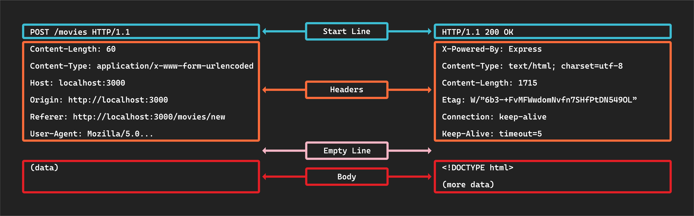

<h1>
  <span class="headline">HTTP Request Response Cycle</span>
  <span class="subhead">Anatomy of HTTP Request Response Messages</span>
</h1>

**Learning objective:** By the end of this lesson, students will be able to describe the structure and components of HTTP request and response messages, including status codes, headers, and the message body in both requests and responses.

## HTTP messages

*HTTP messages* are how requests and responses are made between clients and servers. They follow a specific format. There are two types of messages: those making requests for information and those responding to those requests. Thankfully, we typically do not have to craft these by hand; the browser or server handles that work.

Below is a diagram outlining the structures of both an HTTP request message and an HTTP response message:



Notice they both have a ***Start line*** followed by ***Headers***, an ***Empty line***, and finally, the ***Body*** of the message.

> 📚 An *HTTP message* is a piece of data that follows a specific format. These messages are sent between a client and a server.

## Start line

Every HTTP request message begins with a start line like this:

```plaintext
GET /movies
```

### Method and path

This line will always include two essential components:

1. **HTTP method:** Specifies the action to be performed. For example, `GET` in `GET /movies` is used to retrieve information.

2. **Path/Endpoint:** Indicates the resource's location, such as `/movies` in the example. This tells the server the location of the resource the request is targeting.

Without these two key components, a server does not have enough information to complete a request successfully.

### HTTP status codes

Every response message includes a *status code*, a three-digit number that indicates the result of a request-response transaction.

These codes fall into distinct categories, each representing a different type of response:

- **1xx** (informational): The server got the request. The client may need to take some action to follow up.
- **2xx** (success): The request worked and was successfully processed.
- **3xx** (redirection): The server tells the client to make another request at a different address to continue. Many clients will automatically make this request.
- **4xx** (client error): Indicates a mistake on the client's end, like asking for something that doesn't exist (which would result in a `404` error).
- **5xx** (server error): Indicates that the server couldn't complete the request because of a server issue.

MDN maintains a full list of status codes with a summary of each [here](https://developer.mozilla.org/en-US/docs/Web/HTTP/Status).

> 📚 HTTP *status codes* indicate the outcome of a request, indicating whether the request was successful, caused an error, or requires further action.

## Message headers

HTTP headers act as the messenger carrying additional information and instructions alongside the main content.

**Request headers**: These headers accompany an HTTP request. They provide context about the request, helping the server understand how to process it.

**Response headers**: These headers are included in the HTTP response from the server. They give the client extra information about the response and how to handle it.

## Message body

The message body carries the actual data that needs to be communicated.

When a client sends a request to a server, the body of the message may include data necessary for that request. This is especially common in `POST` requests where the client sends data to the server (like form submissions).

The response from the server often includes a body containing the requested data.

In the above example, the body of the request contains data, while the body of the response returns HTML to be displayed.
