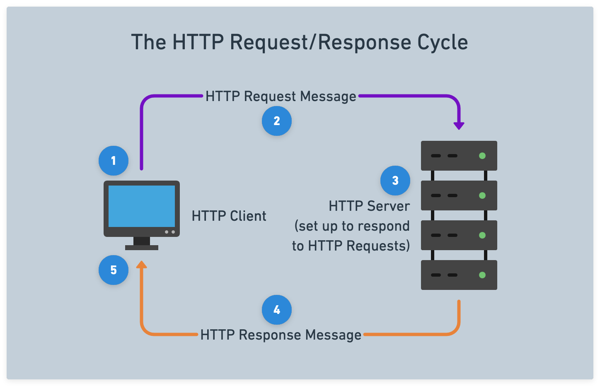

# 

**Learning objective:** By the end of this lesson, students will be able to tktk

## What is HTTP? 

Hypertext Transfer Protocol (HTTP) is an application-level network protocol that powers communications across the web. HTTP is fundamental to web development - regardless of which back-end or front-end web technology/framework is used.

When a user interacts with a web application, it's HTTP that informs the web application what the browser wants, and it's HTTP that delivers data from the server back to the browser. 

## The request/response cycle

The process of a client sending an HTTP request and the server responding to that request is known as the **HTTP request/response cycle**:

1. A user interacts with a piece of client software
2. The client software processes the request and takes an appropriate action depending on the request content
3. Server software processes the request and takes an appropriate action depending on the request content
4. The server software returns a response message
5. The client software processes the response and takes an appropriate action depending on the response content

When the response is received by the client, that request/response cycle has ended and there will be no further HTTP communications unless another request is sent by the client. The request/response cycle is a fundamental communication pattern in client-server architectures, where a client sends a request for data or resources to a server, and the server processes the request and returns an appropriate response back to the client.

## Anatomy of Request and Response Messages

The following diagrams an HTTP Request and Response Message:

Notice they both have a Start line followed by Headers, an Empty line, and finally the Body of the message.

### The status code of the response

The status code in the first line of the response message informs us how the request/response went.

It is always a three-digit number that falls within the following ranges/categories:

- 1xx Informational
- 2xx Success
- 3xx Redirection
- 4xx Client Error
- 5xx Server Error

Most HTTP responses will have a status code of `200`, which means OK. You also might be familiar with the status code of `404` - **Not Found**. MDN maintains a full list of status codes with a summary of each [here](https://developer.mozilla.org/en-US/docs/Web/HTTP/Status).

### Headers

HTTP headers contain crucially important information and instructions for both requests and responses

Request headers will contain information/instructions about the requested resource, while response headers provide information/instructions about the response. 

The **Content-Type** header is a [MIME type](https://developer.mozilla.org/en-US/docs/Web/HTTP/Basics_of_HTTP/MIME_types), which identifies the type of media contained in a request or response. This helps the browser determine what to do with the data. 

### The body of the message

The body contains the data being sent to the server (if any) and the data being returned by the server.

In the above example, the body of the request contains data, while the body of the response returns `HTML`.

Although the HTTP protocol is text-based, the content in the body can be binary - for example, images are typically transferred in a binary format.

