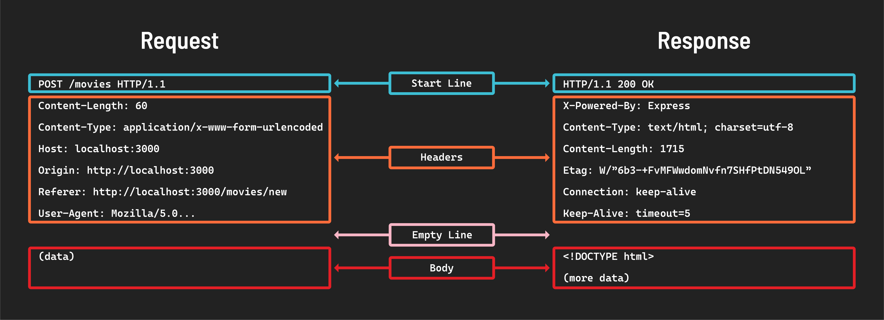

# 

**Learning objective:** By the end of this lesson, students will understand request and response messages.

## Anatomy of request-response messages

Below is a diagram outlining the structures of both an HTTP request message and an HTTP response message:

Notice they both have a Start line followed by Headers, an Empty line, and finally the Body of the message.

### The status code of the response

The status code in the first line of the response message informs us how the request-response went.

It is always a three-digit number that falls within the following ranges/categories:

- 1xx Informational
- 2xx Success
- 3xx Redirection
- 4xx Client Error
- 5xx Server Error

Most HTTP responses will have a status code of `200`, which means OK. You also might be familiar with the status code of `404` - **Not Found**. MDN maintains a full list of status codes with a summary of each [here](https://developer.mozilla.org/en-US/docs/Web/HTTP/Status).

### Headers

HTTP headers contain important information and instructions for both requests and responses. Request headers will contain information/instructions about the requested resource, while response headers provide information/instructions about the response. 

### The body of the message

The body contains the data being sent to the server (if any) and the data being returned by the server.

In the above example, the body of the request contains data, while the body of the response returns `HTML`.

Although the HTTP protocol is text-based, the content in the body can be binary - for example, images are typically transferred in a binary format.