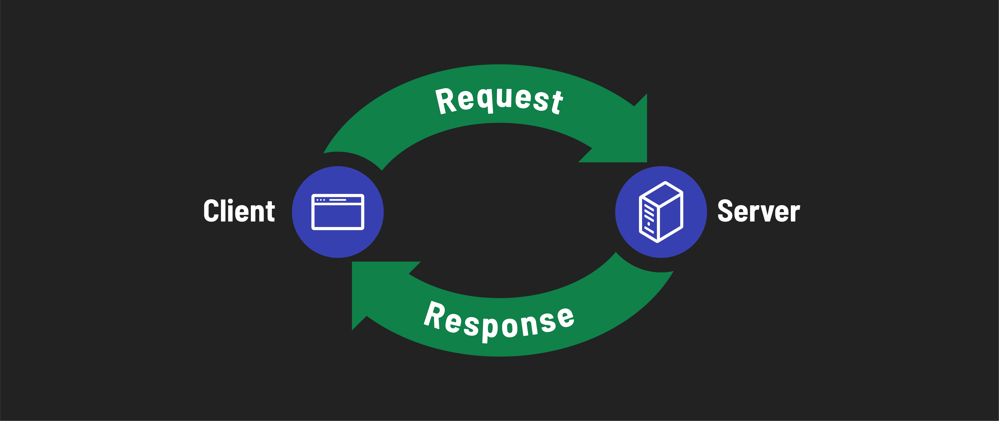

# 

**Learning objective:** By the end of this lesson, students will be able to explain the concept of HTTP (Hypertext Transfer Protocol).

## What is HTTP?

[HTTP (Hypertext Transfer Protocol)](https://developer.mozilla.org/en-US/docs/Web/HTTP) is a set of rules that computers follow when attempting to communicate with each other over the internet. 

Imagine visiting a restaurant. When you enter, you are guided to a table. A waiter approaches, presents a menu, and asks for your order, giving you time to choose. After you make your selection, the waiter relays the order to the kitchen, and then brings your meal when it is ready. This sequence is a *protocol*, a set of established rules, for dining in a restaurant. If you tried to order directly from the chef or if the waiter brought random dishes without your request, the system would become confusing and chaotic. Similarly, computers use the HTTP protocol to request and receive data from servers over the internet. This protocol ensures a smooth and orderly transfer of data, just like the rules in a restaurant guide the order and delivery of your meal.

When you visit a website, your computer's browser uses the HTTP protocol to communicate with another computer, known as a *server*. This server, located somewhere in the world, is always connected to the internet and ready to respond to incoming requests. In this interaction, your computer is referred to as the *client*. 

To draw a parallel with our restaurant analogy, consider the restaurant's waitstaff as 'servers.' No pun intended. They are there to respond to your orders or requests. Similarly, you, the diner in the restaurant, represent the 'client' in this scenario, making requests and waiting for responses. Just as servers in the restaurant take your order and bring you your meal, the server in the digital world receives your browser's request and sends back the desired web page or information.

> 📚 A *server* is a computer or system that provides data to other computers, known as clients, over a network. A *client* is a device or computer program (like a browser) that sends requests to a server.

