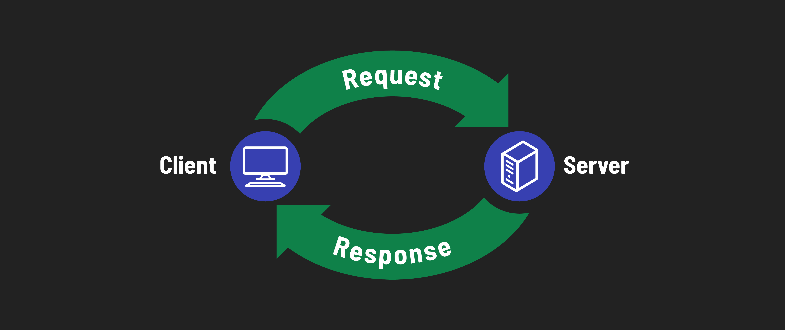
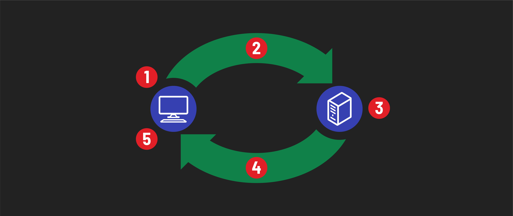

# 

**Learning objective:** By the end of this lesson, students will be able to define what HTTP is, and what an HTTP request/response cycle looks like.

## What is HTTP? 

Imagine going to a restaurant. When you arrive, you sit (or are seated) at a table. A waiter then comes over, gives you a menu, and asks what you would like to order (hopefully giving you time to think about it). You tell them, and they then bring the food over to you. This is a protocol (or set up rules) for how to order food at a restaurant. If you were to go in and immediately order food from the cashier, things would break down. If the waiter expected you to be the one that would go back to the kitchen to get your own food, things would break down as well. We need to follow protocols in real life in order for things to run smoothly.

[HTTP (Hypertext Transfer Protocol)](https://developer.mozilla.org/en-US/docs/Web/HTTP) is the set of rules that computers follow when attempting to communicate with each other over the web. When a you use your browser to go to a website, your browser/computer follows the steps defined in HTTP for how to request information from another computer that is somewhere out there in the world, powered on, hooked up to the internet, and waiting for requests. In this scenario, the other computer is called a *server*, and your computer is called the *client*. Returning to the restaurant analogy, think of the waiters as the servers - they respond to your requests, and you, the diner, are the client.

> 📚 A *server* is a computer or system that provides data to other computers, known as clients, over a network.
>

> 📚 A *client*, exemplified by tools like a web browser, is a computer program or system that sends requests for data to a server.
>

## The request-response cycle

The **HTTP request-response cycle** refers to the process where a client sends an *HTTP request* and the server subsequently issues an *HTTP response* to that request.

> 📚 An *HTTP request* is a message sent by a client to a server, asking for specific resources or actions.
>

> 📚 An *HTTP response* is the message a server sends back to the client as a reply to an HTTP request.
>

Here's a diagram to help illustrate the steps in this process:

1. A user interacts with a piece of client software (e.g. a web browser)
2. The client software processes the interaction and requests information from a server, depending on the interaction
3. The server software processes the request and takes an appropriate action depending on the request content
4. The server software returns a response message
5. The client software processes the response and takes an appropriate action depending on the response content

When the response is received by the client, that request-response cycle has ended and there will be no further HTTP communications unless another request is sent by the client.