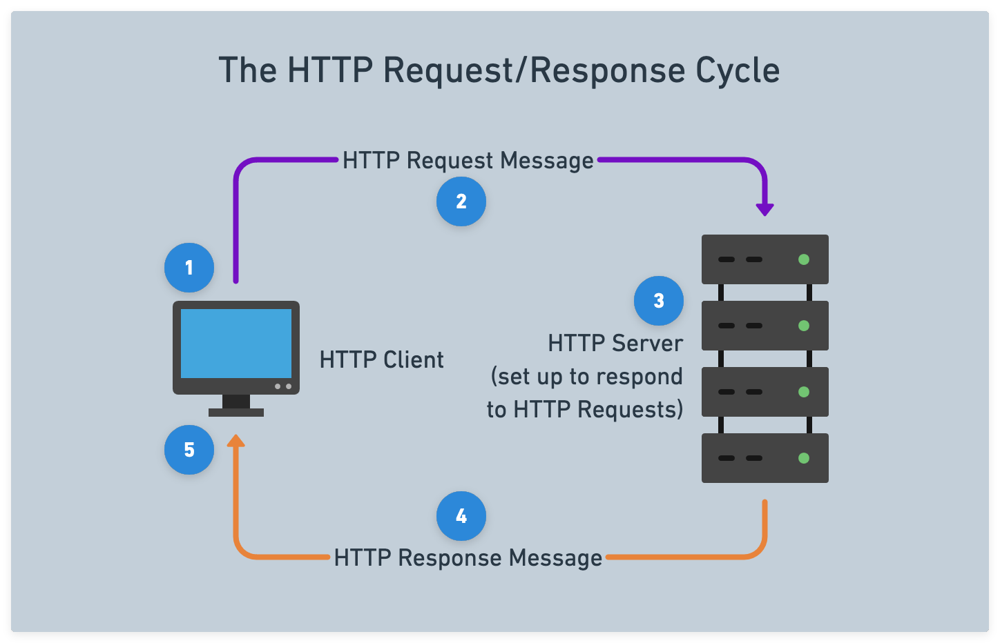

# 

**Learning objective:** By the end of this lesson, students will be able to define what HTTP is, and what an HTTP request/response cycle looks like.

## What is HTTP? 

Hypertext Transfer Protocol (HTTP) is an application-level network protocol that powers communications across the web. HTTP is fundamental to web development - regardless of which back-end or front-end web technology/framework is used.

When a user interacts with a web application, it's HTTP that informs the web application what the browser wants, and it's HTTP that delivers data from the server back to the browser. 

## The request/response cycle

The process of a client sending an HTTP request and the server responding to that request is known as the **HTTP request/response cycle**:

1. A user interacts with a piece of client software
2. The client software processes the request and takes an appropriate action depending on the request content
3. Server software processes the request and takes an appropriate action depending on the request content
4. The server software returns a response message
5. The client software processes the response and takes an appropriate action depending on the response content

When the response is received by the client, that request/response cycle has ended and there will be no further HTTP communications unless another request is sent by the client. The request/response cycle is a fundamental communication pattern in client-server architectures, where a client sends a request for data or resources to a server, and the server processes the request and returns an appropriate response back to the client.

