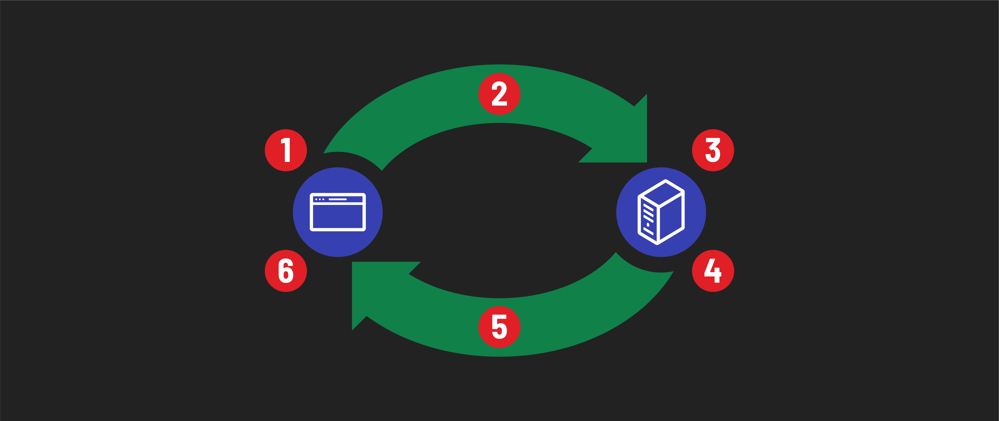

# 

**Learning objective:** By the end of this lesson, students will be able to explain the HTTP request-response cycle in detail, including understanding the roles and actions of both the client and server at each stage.

## Understanding the request-response cycle

Let's take a deeper look into each stage of this the request-response cycle:

tktk Hunter, we should update this asset based on the work you did in the concepts lecture for this. This also involved a copy change (adding the server receiving the request, which I've already made)

1. The user interacts with the client software:
    - When you click a link, submit a form, or navigate to a URL, your web browser prepares to send a request to a server.
    - Think of each action you take as a specific request. Different types of request may be carried out depending on the type of action that is made, but all generate requests.
2. The client software processes the user interaction:
    - Your browser turns your action into an HTTP request. This includes choosing the right method (like GET or POST), the URL, and additional details like browser type.
    - Different actions (like clicking a link vs. submitting a form) use different types of requests. It's like choosing a different way to ask for something.
3. The server software receives and processes the request:
    - The server receives your request and figures out what to do. It might grab data, update something, or perform another task.
    - Servers can do a lot based on your request. When you ask for a webpage, the server finds all the pieces to put it together for you.
4. Server Returns a Response Message:
    - After the server does its work, it sends back a response. This includes a status code (like '200' for success) and often the data you asked for.
    - The status code is a quick way for the server to tell your browser how things went (success, error, or something else).
5. Client Processes the Response:
    - Your browser gets the response and acts on it. If it's a webpage, your browser shows it to you. If there's an error, it lets you know.
    - Your browser's job is to make sense of the server's response. Just like when you receive an answer, you react based on what you hear.

When the response is received by the client, that request-response cycle has ended and there will be no further HTTP communications unless another request is sent by the client.
