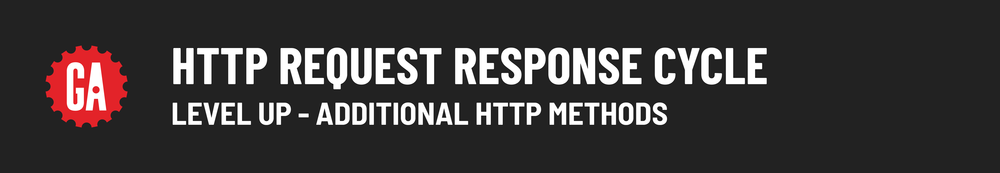

# 

tktk Optional student-facing level up content should be added here. Not all modules will have Level Up content - if it doesn't, the `level-up` directory should be deleted, and the **Level Up content** section in the main `README.md` file should be removed.
