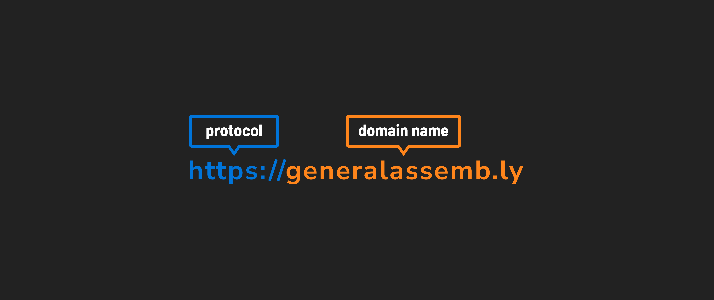
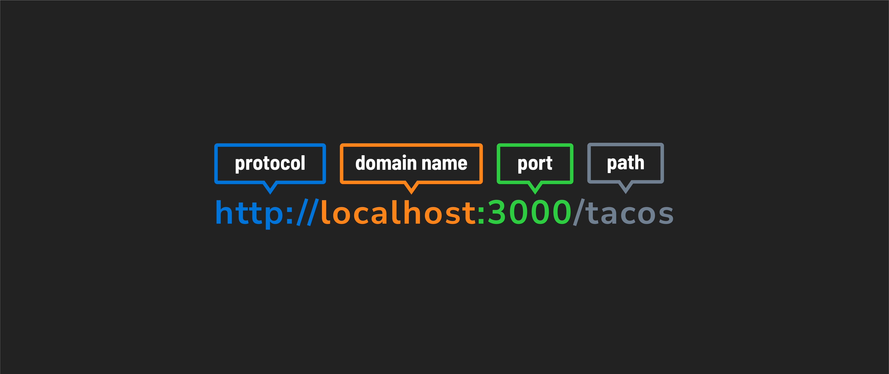
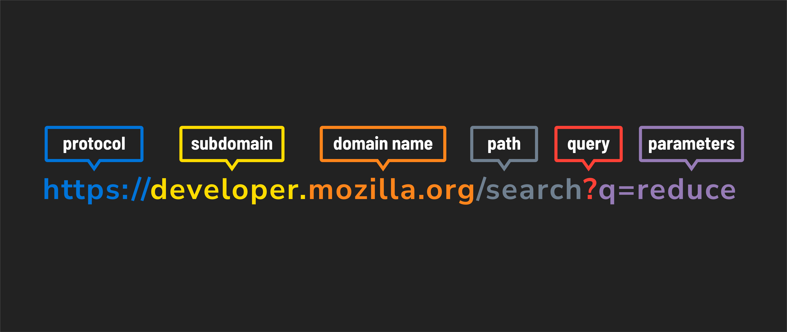

# 

**Learning objective:** By the end of this lesson, students will be able to identify and explain the various methods a browser uses to send HTTP requests, including the URL's role in navigating to requested resources.

## Ways to send an HTTP request from the browser

Browsers provide several ways to initiate HTTP requests, each suitable for different scenarios:

| User action                 | HTTP method(s) | Details |
|-----------------------------|----------------|---------|
| Using the address bar     | `GET`         | When a URL is entered in the address bar, the browser sends a `GET` request to retrieve a web page or resource.                                              |
| User submits an HTML form | `POST`, `GET` | POST is used for submissions that change server data (like account creation). `GET` is used for search forms, appending data in the URL as query parameters. |
| User clicks a link        | `GET`         | Clicking a link triggers a `GET` request to navigate to a new page or download a resource.                                                                   |
| Executing JavaScript      | All           | JavaScript can use any HTTP method (`GET`, `POST`, `PUT`, `DELETE`, etc.) to allow for more dynamic requests.                                                |

## URLs

URL stands for **Uniform Resource Locator** and is commonly known as a ***web address***. Its primary function is to identify and locate a resource, which aligns perfectly with the purpose of the `GET` method in HTTP — to retrieve or get a resource.

> 🧠 Other methods like `POST`, `PUT`, or `DELETE` require additional data beyond what a URL alone can provide. That information is included in the request message, not the URL.

### Common URLs

tktk Hunter could you add an asset for this? I want there to be a lighter ramp in this lecture than there is now.

Go to <https://generalassemb.ly>.

#### Components

- **Protocol**: `https` - Signifies a secure, encrypted connection.
- **Domain name**: `generalassemb.ly` - Represents the internet address of the website or server.

### Local URLs

This is a basic URL often used for local development. These typically begin with `http://localhost`.

Developers commonly use `localhost` when building and testing web applications on their machines. It does not involve the internet; rather, the server runs locally on the developer's computer.

Go to <http://localhost:3000/tacos> (note that this will result in an error).

#### Components

- **Protocol**: `http` - Indicates the use of the Hypertext Transfer Protocol. Note that this connection is not encrypted (which often isn't a concern in local development).
- **Domain name**: `localhost` - Refers to the local computer, specifically the one on which the development server is running.
- **Port**: `3000` - Specifies the network port on which the server is listening. Developers can choose different ports to run different projects simultaneously. If no server is running at `http://localhost:3000` when we make a request, the client will display an error indicating it can't connect to the server.
- **Path**: `/tacos` - This specifies that we want to visit a page in our local project called `tacos`.

### Complex URLs with query parameters

This URL is typically used for specific and dynamic requests on the internet. This URL structure is common for interacting with online resources. The query parameters, in this case, are used for search functionality, enabling users to find specific information on the website.

Go to <https://developer.mozilla.org/search?q=reduce>.

#### Components

- **Protocol**: `https` - Signifies a secure, encrypted connection.
- **Subdomain**: `developer.` - A subdomain of the `mozilla.org` domain. Subdomains organize different sections of websites and serves as a distinct section under the subdomain.
- **Domain name**: `mozilla.org` - Represents the internet address of the website or server.
- **Path**: `/search` - Identifies a specific resource or page, in this case, the search page on the website.
- **Query parameters**: `?q=reduce` - Sends additional information to the server. Here, `q=reduce` indicates a search query for the term "reduce".
