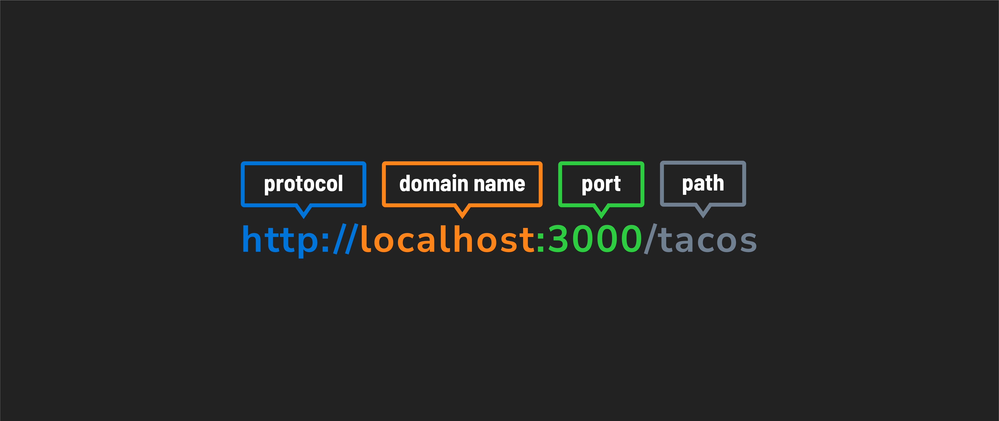
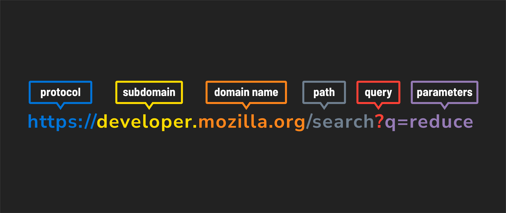

# 

**Learning objective:** By the end of this lesson, students will be able to read URLs with a deeper understanding of their syntax. 

## URLs

URL stands for **Uniform Resource Locator**. A URL specifies where on the internet a resource can be found - which is why they are also commonly referred to as a "web address."

The URL also informs the server of what resource the client wants to GET, POST, DELETE, or UPDATE.

Here's the anatomy of a couple of URLs:

